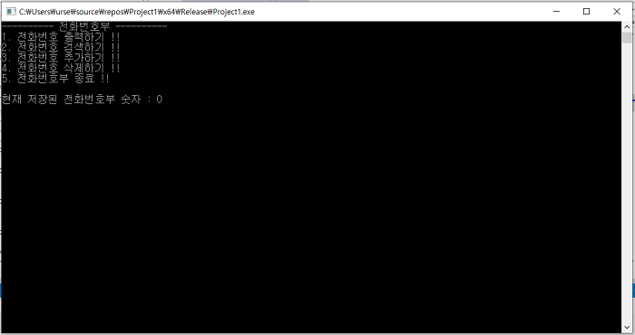
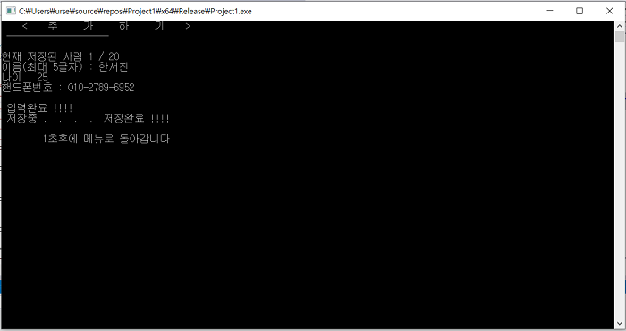
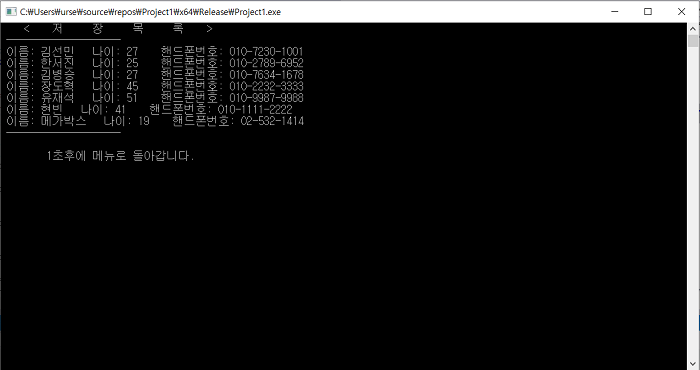
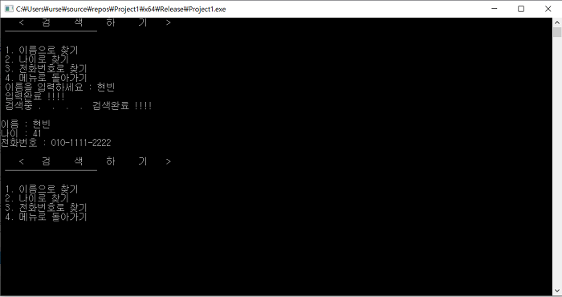
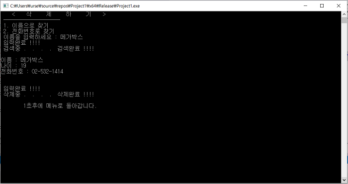

# PhoneBook_Manage
전화번호부 관리 (추가, 삭제, 검색 / C언어 구조체 공부)

### Version 1.
- 전화번호부_단순구조체.cpp

### Version 2.
- 전화번호부_동적할당 및 구조체.cpp

### Version 3.
- 전화번호부_구조체 내 포인터 배열.cpp

### 실행사진

#### (1) 기본화면

#### (2) 전화번호부 추가

#### (3) 전화번호부 출력

#### (4) 전화번호부 검색

#### (5) 전화번호부 삭제하기

